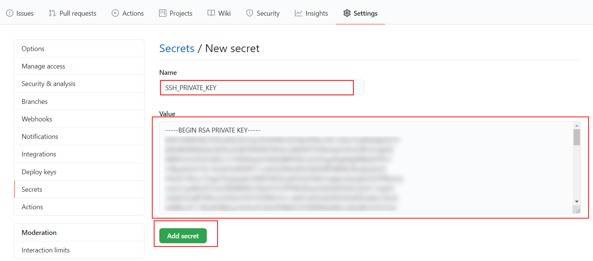
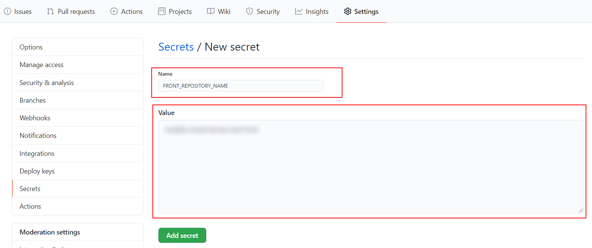

# 04 Heroku one dyno

In this example we are going to upload backend and frontend apps to one Heroku Dyno

We will start from `05-heroku-back/01-implementation`.

# Steps to build it

- `npm install` to install previous sample packages:

```bash
npm install
```

- If we want only one Heroku Dyno to serve this app, we can use backend server to public `static files`.

- Add npm commands:

_./pacakge.json_

```diff
...
  "scripts": {
    "start": "run-p -l type-check:watch start:dev start:local-db",
    "start:dev": "nodemon --exec babel-node --extensions \".ts\" src/index.ts",
+   "start:prod": "node dist/index.js",
...
  },
```

- We need to update `app.ts` to use this static files. Update `env variables`:

_./.env.example_

```diff
NODE_ENV=development
PORT=8081
CORS_ORIGIN=http://localhost:8080
MONGODB_URI=mongodb://localhost:27017/demo-cloud
+ STATIC_FILES_PATH=../dist/public
```

_./.env_

```diff
NODE_ENV=development
PORT=8081
CORS_ORIGIN=http://localhost:8080
MONGODB_URI=mongodb://localhost:27017/demo-cloud
+ STATIC_FILES_PATH=../dist/public

```

- Update constants:

_./src/core/env.constants_

```diff
export const envConstants = {
  isProduction: process.env.NODE_ENV === 'production',
  PORT: process.env.PORT,
  CORS_ORIGIN: process.env.CORS_ORIGIN,
  MONGODB_URI: process.env.MONGODB_URI,
+ STATIC_FILES_PATH: process.env.STATIC_FILES_PATH,
};

```

- Update app:

_./src/app.ts_

```diff
+ import express from 'express';
+ import path from 'path';
import { envConstants } from 'core/constants';
import { createApp } from 'core/servers';
import { connectToDB } from 'core/database';
import { memberApi } from 'pods/member';

const app = createApp();

app.use('/members', memberApi);

+ const staticFilesPath = path.resolve(__dirname, envConstants.STATIC_FILES_PATH);
+ app.use('/', express.static(staticFilesPath));

app.listen(envConstants.PORT, async () => {
  await connectToDB(envConstants.MONGODB_URI);
  console.log(`Server ready at PORT ${envConstants.PORT}`);
});

```

- Let's do it locally, build front project and copy `dist` folder to back `dist/public`:

```bash
# Front project
npm run build
```

```bash
# Back project
npm run build

## dist folder
|- core/
|- dals/
|- pods/
|- app.js
|- index.js

## Create public folder and copy front dist files
|- core/
|- dals/
|- pods/
|- public/
|---- images/
|---- js/
|---- index.html
|- app.js
|- index.js

```

- Run start:

```bash
# First terminal
npm run start:prod

# Second terminal
npm run start:local-db
```

> We have not any members from Facebook organisation in backend, but we just run front and back in one Nodejs process.

- This means that we don't need any cors configuration in `front` nor `back`. But we need a way to clone front repository in Dockerfile and build front project. That is, we need permissions to clone front repository, an ssh key:

```bash
ssh-keygen -m PEM -t rsa -C "cd-user@my-app.com"
```

- Copy `id_rsa.pub` content to `FRONTEND` project > `Github Settings` > `Deploy keys` section:


- Delete `id_rsa.pub` file.

- Copy `id_rsa` content to `BACKEND` project > `Github Settings` > `Secrets` section:




- Delete `id_rsa` file.

- We need add the `FRONT_REPOSITORY_NAME` (`<user-name>/<repository-name>`) to clone front repository and `BASE_API_URL` to build front app:




> IMPORTANT: remove last `/`

Result Backend's secrets:


- Update the CD workflow file:

_./.github/workflows/cd.yml_

```diff
name: Continuos Deployment workflow

on:
  push:
    branches:
      - master
env:
  HEROKU_API_KEY: ${{ secrets.HEROKU_API_KEY }}
  IMAGE_NAME: registry.heroku.com/${{ secrets.HEROKU_APP_NAME }}/web
+ FRONT_PATH: ./front

jobs:
  cd:
    runs-on: ubuntu-latest
    steps:
      - name: Checkout repository
        uses: actions/checkout@v3
+     - name: Checkout front repository
+       uses: actions/checkout@v3
+       with:
+         repository: ${{ secrets.FRONT_REPOSITORY_NAME }}
+         path: ${{ env.FRONT_PATH }}
+         ssh-key: ${{ secrets.SSH_PRIVATE_KEY }}
      - name: Heroku login
        run: heroku container:login
      - name: Build docker image
-       run: docker build -t ${{ env.IMAGE_NAME }} .
+       run: docker build --build-arg BASE_API_URL=${{secrets.BASE_API_URL}} --build-arg FRONT_PATH=${{env.FRONT_PATH}} -t ${{ env.IMAGE_NAME }} .
      - name: Deploy docker image
        run: docker push ${{ env.IMAGE_NAME }}
      - name: Release
        run: heroku container:release web -a ${{ secrets.HEROKU_APP_NAME }}

```

> [Docker build-arg](https://docs.docker.com/engine/reference/commandline/build/#set-build-time-variables---build-arg)

- Update Dockerfile:

_./Dockerfile_

```diff
FROM node:16-alpine AS base
RUN mkdir -p /usr/app
WORKDIR /usr/app

+ # Build front
+ FROM base AS build-front
+ ARG BASE_API_URL
+ ENV BASE_API_URL=$BASE_API_URL
+ ARG FRONT_PATH
+ COPY $FRONT_PATH ./
+ RUN npm ci
+ RUN npm run build

# Build backend
FROM base AS build-backend
COPY ./ ./
RUN npm ci
RUN npm run build

# Release
FROM base AS release
+ ENV STATIC_FILES_PATH=./public
+ COPY --from=build-front /usr/app/dist $STATIC_FILES_PATH
COPY --from=build-backend /usr/app/dist ./
COPY ./package.json ./
COPY ./package-lock.json ./
RUN npm ci --only=production

ENTRYPOINT [ "node", "index" ]

```

- Commit and push.

```bash
git add .
git commit -m "deploy front and back together"
git push
```

- Update heroku portal env variables:


```diff
- CORS_ORIGIN=...
+ CORS_ORIGIN=false
MONGODB_URI=...

```
> Not need to define `STATIC_FILES_PATH` env variable, because we set it on Dockerfile, but we can replace on heroku if we want.

Open backend Heroku server: `https://<heroku-app-name>.herokuapp.com/`

# About Basefactor + Lemoncode

We are an innovating team of Javascript experts, passionate about turning your ideas into robust products.

[Basefactor, consultancy by Lemoncode](http://www.basefactor.com) provides consultancy and coaching services.

[Lemoncode](http://lemoncode.net/services/en/#en-home) provides training services.

For the LATAM/Spanish audience we are running an Online Front End Master degree, more info: http://lemoncode.net/master-frontend
