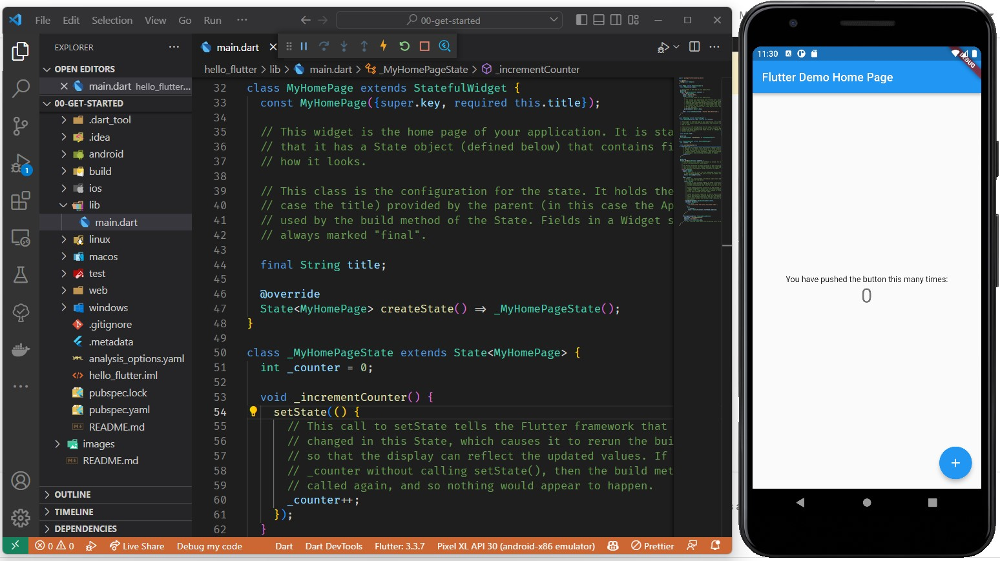

# Get Started

## Crear un nuevo proyecto

Vamos a crear un proyecto de Flutter. Para esto, desde VS Code:

- Abrimos desde el menú superior `View > Command Palette` (o pulsamos `F1`)
- Escribimos `Flutter: New Project`.
- Seleccionamos la carpeta donde queremos crear el proyecto.
- Le damos un nombre a nuestro proyecto. Por ejemplo, `hello_flutter`.
- Esperamos a que se cree el proyecto y se abrirá el fichero main.dart.

## Seleccionar y abrir un dispositivo

Desde la barra de estado de VS Code (la barra inferior azul), seleccionamos un dispositivo desde el area de `Device Selector`:

Podemos seleccionar un emulador de los que tengamos creados desde Android Studio AVD Manager, un dispositivo físico conectado por USB, o incluso lanzar la aplicación de Windows o en un navegador web.

## Ejecutar la aplicación

Con el fichero `main.dart` abierto, pulsamos `F5` o desde el menú superior `Run > Start Debugging` para ejecutar la aplicación.

Según el dispositivo que hayamos seleccionado, se abrirá la aplicación en el emulador, en el navegador web, en una aplicación Windows, o en el dispositivo físico:

